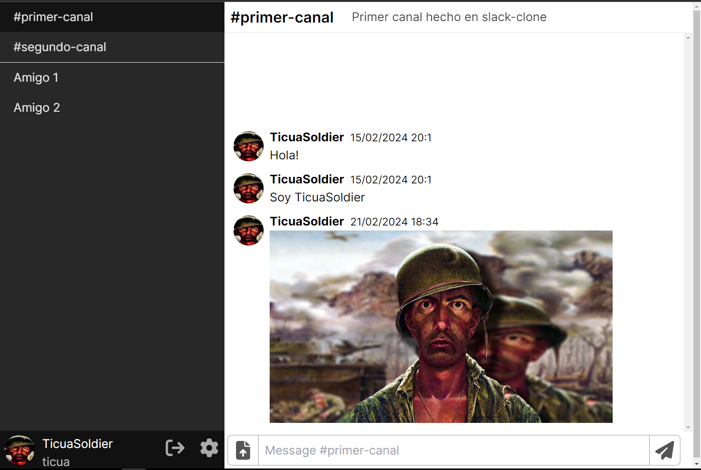

<h1 align="center">Slack clone</h1>


<p align="center">
 A Slack clone built on Nextjs 14, Supabase and Tailwind
</p>


## Clone and run locally

1. You'll first need a Supabase project which can be made [via the Supabase dashboard](https://database.new)

2. Create a Next.js app using the Supabase Starter template npx command

   ```bash
   git clone git@github.com:ticua07/slack-clone.git
   ```

3. Use `cd` to change into the app's directory

   ```bash
   cd slack-clone
   ```

3. Install dependencies

   ```bash
   # pnpm install
   # yarn install
   npm install
   ```


4. Rename `.env.example` to `.env` and update the following:

   ```
   NEXT_PUBLIC_SUPABASE_URL=[INSERT SUPABASE PROJECT URL]
   NEXT_PUBLIC_SUPABASE_ANON_KEY=[INSERT SUPABASE PROJECT API ANON KEY]
   ```

   Both `NEXT_PUBLIC_SUPABASE_URL` and `NEXT_PUBLIC_SUPABASE_ANON_KEY` can be found in [your Supabase project's API settings](https://app.supabase.com/project/_/settings/api)

5. You can now run the Next.js local development server:

   ```bash
   npm run dev
   ```

   The app should now be running on [localhost:3000](http://localhost:3000/).

## Contributing

- `/utils/`: contains mostly server-side utilities, like the supabase cached and non-cached client, as well as some error handling for form server actions.

- `/types/`: contains types for almost all the application.

- `/app/api/`: contains API that user interacts with, All of the API is done for easier fetching, updating/sending data is handled by supabase client.

## Extra

Check out [the docs for Local Development](https://supabase.com/docs/guides/getting-started/local-development) to run Supabase locally.
